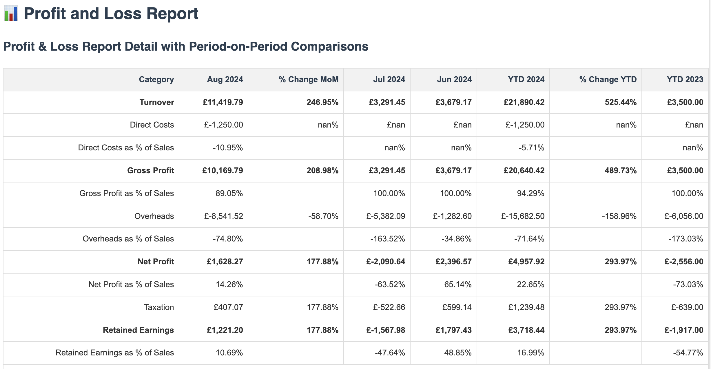
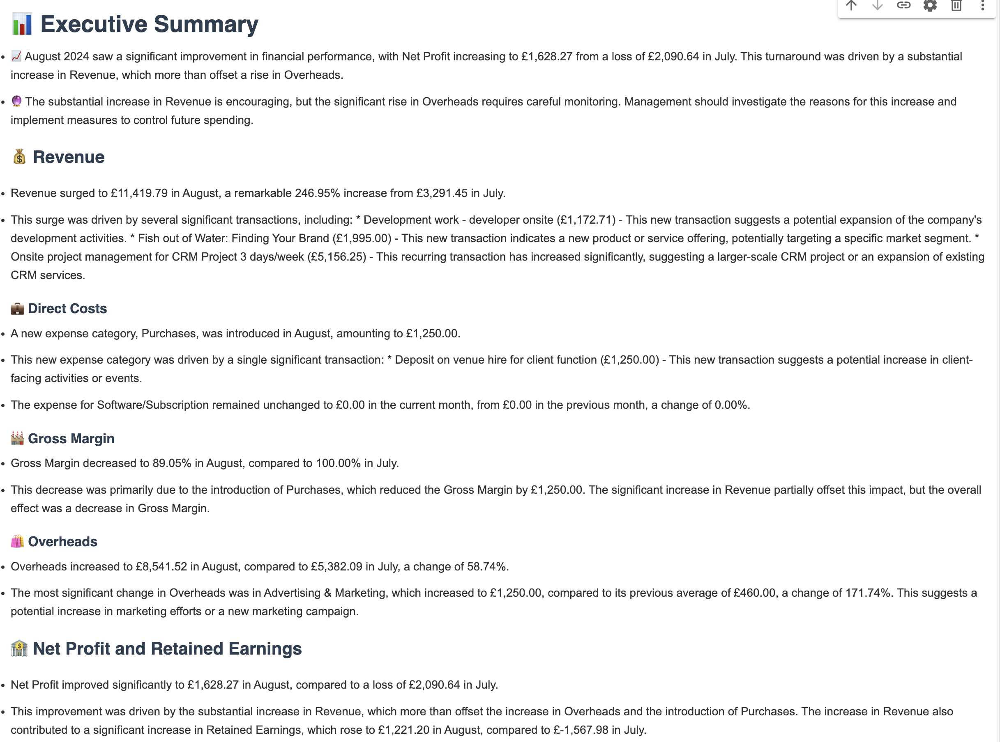
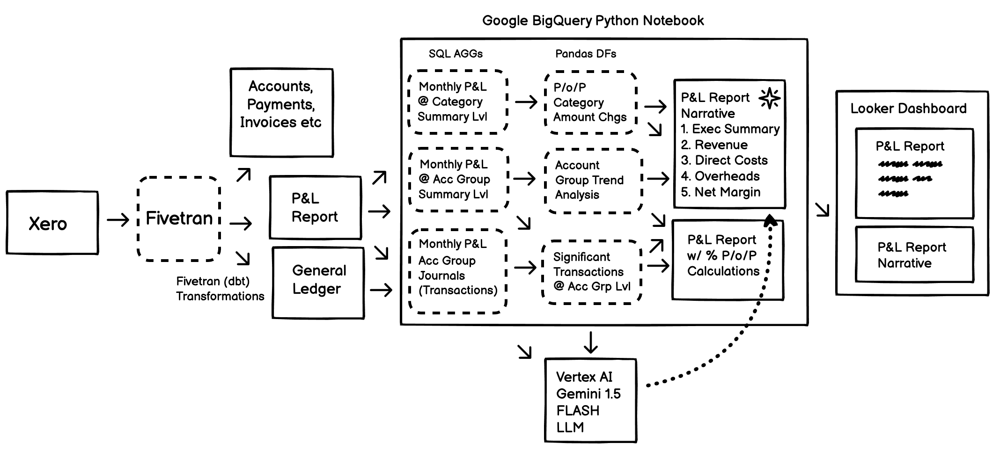

# Automated Profit & Loss (Income Statement) Analyzer + Commentary using VertexAI GenAI

This notebook performs a comprehensive Profit and Loss (P&L) analysis using financial data from a Xero Demo Company dataset. It leverages Google BigQuery for data retrieval and Google Vertex AI for generating insightful analysis using natural language processing.

### Example extended report generated from standard Xero P&L Report


### Example report narrative and analysis from standard Xero P&L Report


## Overview

This notebook automates the process of generating a detailed P&L report by:
1. Fetching financial data from BigQuery
2. Processing and analyzing the data
3. Using Vertex AI to generate natural language insights
4. Producing a comprehensive HTML report



## P&L Analysis Process

The notebook performs a detailed analysis of the Profit and Loss (P&L) data through several steps before leveraging the LLM for insights.

### 1. Account Category Summarization

- The P&L data is first summarized at the account category level (e.g., Revenue, Cost of Delivery, Overheads).
- This provides a high-level view of the company's financial performance.

### 2. Period-on-Period Changes

- The notebook calculates changes between different time periods:
  - Month-over-Month (MoM)
  - Year-to-Date (YTD) vs. Previous Year-to-Date
- These calculations highlight overall trends and significant shifts in financial performance.

### 3. Account Group Breakdown

- Within each account category, the data is further broken down by account groups.
- This more granular view helps identify which specific areas are driving changes in the broader categories.

### 4. Account Group Trend Analysis

- The notebook analyzes trends within account groups over time.
- It identifies groups with significant growth or decline, which may require further investigation.

### 5. Significant Transaction Identification

- For account groups showing significant period-on-period changes, the notebook identifies individual transactions that are primarily responsible for these changes.
- This step helps pinpoint the root causes of major financial shifts.

### 6. Data Preparation for LLM Analysis

- All the above calculations and findings are structured into a format suitable for LLM processing.
- This includes:
  - Overall financial summaries
  - Detailed breakdowns of significant changes
  - Lists of notable transactions and their impacts

### 7. LLM Analysis and Commentary

- The structured data is passed to the Vertex AI model via a carefully constructed prompt.
- The LLM then generates insights, including:
  - Summary of overall financial performance
  - Commentary on significant changes and their potential causes
  - Identification of trends and their possible implications
  - Recommendations based on the financial data

### 8. Report Generation

- The LLM's output is combined with the structured financial data and any generated visualizations.
- This comprehensive information is formatted into an HTML report for easy reading and sharing.

This multi-step analysis process ensures that the LLM has access to thoroughly processed and contextualized financial data, enabling it to provide more accurate, relevant, and insightful commentary on the company's financial performance.

## Prerequisites

- Google Cloud Platform account with BigQuery and Vertex AI enabled
- Python 3.7+
- Required Python libraries: `pandas`, `matplotlib`, `google-cloud-bigquery`, `google-cloud-aiplatform`, `langchain`

## Setup

1. Clone this repository
2. Install required Python libraries: `pip install -r requirements.txt`
3. Set up Google Cloud credentials
4. Update the `PROJECT_ID`, `DATASET_ID`, and `LOCATION` variables in the notebook

## Data Source

The data for this notebook comes from the Fivetran Xero dbt transformation package. This package processes raw Xero data loaded by Fivetran's connector and produces analytics-ready models.

### Key Features of the Xero Transformation dbt Package:

- Produces modeled tables leveraging Xero data from Fivetran's connector
- Provides analytics-ready models, including profit and loss report, general ledger, and balance sheet report
- Generates a comprehensive data dictionary through the dbt docs site

### Key Tables Used:

1. **xero__general_ledger**: Contains journal line items, used for creating balance sheets and profit and loss statements.
2. **xero__profit_and_loss_report**: Represents profit and loss line items at the month and account level.
3. **xero__balance_sheet_report**: Shows the state of the balance sheet for each account on a monthly basis.
4. **xero__invoice_line_items**: Contains invoice line items enriched with account, contact, and invoice information.

### Fivetran Transformations:

Fivetran offers the ability to run this dbt package automatically when loading Xero data. This process reshapes the data for optimization in downstream processes like data visualization or machine learning.

Fivetran provides two transformation solutions:
1. **Pre-built data models**: Analytics-ready tables created by Fivetran, available directly in the Fivetran dashboard or importable into a dbt project.
2. **Integrations**: Use Fivetran-hosted dbt Core or third-party dbt Cloud orchestration to manage all transformations in your dbt project.

These transformations run in your destination through dbt Core or are triggered to run by third parties like dbt Cloud, following the ELT (Extract, Load, Transform) model.

## Key Components

- `get_pl_data`: Retrieves financial data from BigQuery
- `process_data`: Processes and structures the retrieved data
- `generate_analysis_prompt`: Constructs the prompt for Vertex AI
- `generate_report_html`: Creates the HTML report

## Gen AI Integration

This notebook uses Google Vertex AI, integrated through the LangChain library, to generate natural language insights from the processed financial data.

### Prompt Construction

The `generate_analysis_prompt` function constructs a detailed prompt for Vertex AI. Key aspects of the prompt include:

1. **Context Provision**: The prompt includes processed financial data, account group details, and cost change analysis.

2. **Specific Instructions**: It provides clear guidelines on what to focus on in the analysis, such as revenue, cost of delivery, and significant transactions.

3. **Output Structuring**: The prompt specifies the desired HTML structure for the output, ensuring a consistent and well-organized report.

4. **Analytical Guidance**: It provides guidance on how to approach the analysis, including comparing current performance to previous periods and identifying significant changes.

5. **Customized Formatting**: Instructions for using specific styles and tags in the output are included.

### Example Prompt Structure:

```python
def generate_analysis_prompt(month, financial_data, account_group_details, cost_change_analysis):
    return PromptTemplate.from_template("""
    Analyze the following Profit and Loss data for {month} and provide a management report:

    {financial_data}

    Account Group Details (including significant transactions):
    {account_group_details}

    Cost Change Analysis:
    {cost_change_analysis}

    ... [Detailed instructions and formatting guidelines] ...

    <h1>📊 Executive Summary</h1>
    <ul>
        <li>📈 [Key summary point about overall financial performance]</li>
        <li>🔮 [Key summary point about future outlook or recommendations]</li>
    </ul>

    ... [More structured output guidelines] ...
    """)
```

### Vertex AI Configuration

The Vertex AI model is configured in the `initialize_clients` function:

```python
llm = VertexAI(
    model_name='gemini-1.5-flash-001',
    max_output_tokens=2048,
    temperature=0,
    top_p=0.9,
    top_k=30,
    project=PROJECT_ID,
    location=LOCATION,
    verbose=True,
)
```

This configuration aims to produce consistent, focused outputs while allowing for some natural language variation.

## Data Processing

The notebook processes financial data through several steps:
1. Retrieval from BigQuery
2. Data cleaning and structuring
3. Calculation of key financial metrics
4. Preparation of data for Gen AI analysis

## Report Generation

The final report is generated as an HTML document, combining:
1. Gen AI-generated insights
2. Structured financial data tables
3. Visualizations (if applicable)

## Output

The notebook produces:
1. An HTML report displayed in the notebook
2. Data stored in BigQuery for future reference

## Customization

To customize this notebook for your needs:
1. Modify the SQL queries in `get_pl_data` to match your data structure
2. Adjust the `generate_analysis_prompt` function to focus on specific areas of interest
3. Update the HTML generation in `generate_report_html` to change the report layout

---

For more information or to report issues, please open an issue in this GitHub repository.
